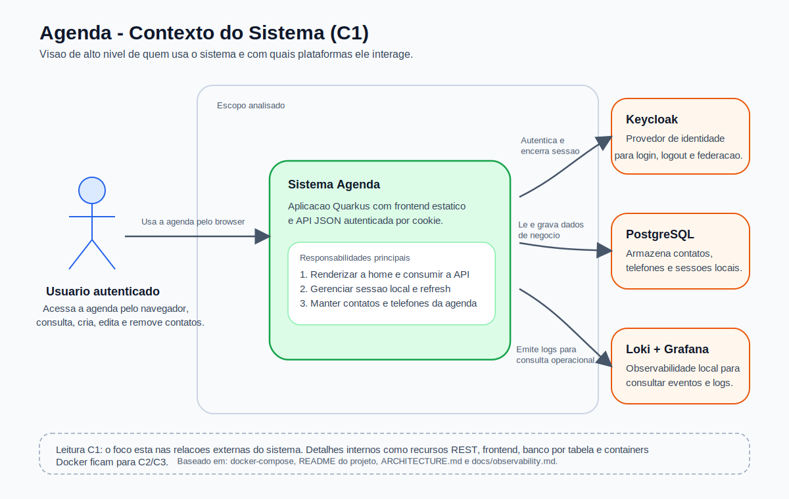

# Agenda Project

Arquitetura
--

Diagrama C1 com a visao de contexto do sistema:



Video do app rodando: https://youtu.be/5at07y3Ndtw

Quickstart
--

1. Copy `example.env` to `.env` and adjust values if necessary:

```bash
cp example.env .env
```

2. Start the stack:

```bash
docker-compose up --build
```

3. Health check: `http://localhost:${QUARKUS_HOST_PORT:-8080}/api/health`

Environment files
--

- `example.env`: tracked example with default values. Use as a template.
- `.env`: local environment overrides — recommended to keep out of version control. `.env` is listed in `.gitignore`.

Why this pattern
--

Keeping an example env file in the repo documents required variables and default values while preventing accidental commits of secrets or machine-specific settings. Before running `docker-compose` copy the example and provide secure values when appropriate.
